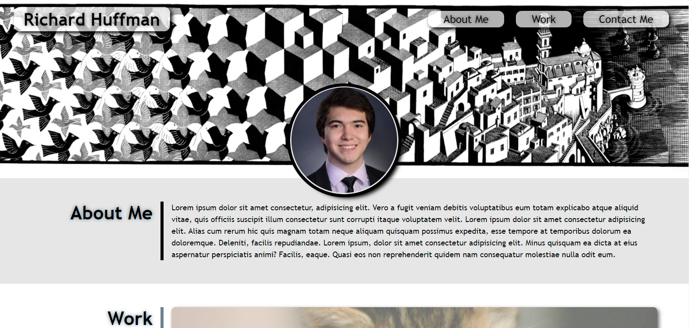
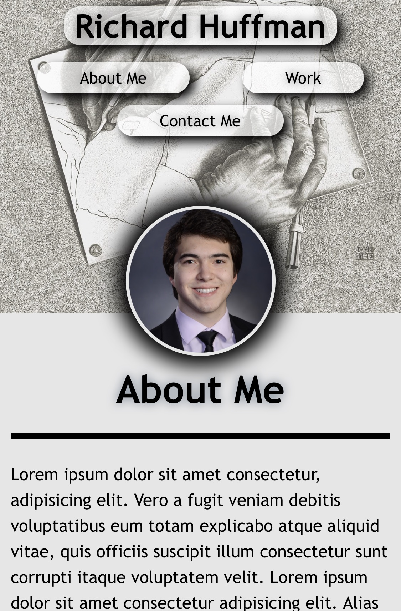

# Portfolio

This is a website built using HTML and CSS, with the purpose of showcasing all of the projects worked on by Richard Huffman.

## Usage

The website can be accessed via the link: [https://chardmuffin.github.io/portfolio/](https://chardmuffin.github.io/portfolio/)

Scroll up and down the page to view sections, or click the links in the header to jump down the page. You can click on the cards in the "Work" section to visit a deployed project. The "Contact Me" section contains links to external sites, and the option to compose a message in the user's default email client.

Preview of landing page on desktop:

Preview of landing page on mobile:

## License
[MIT](https://choosealicense.com/licenses/mit/)